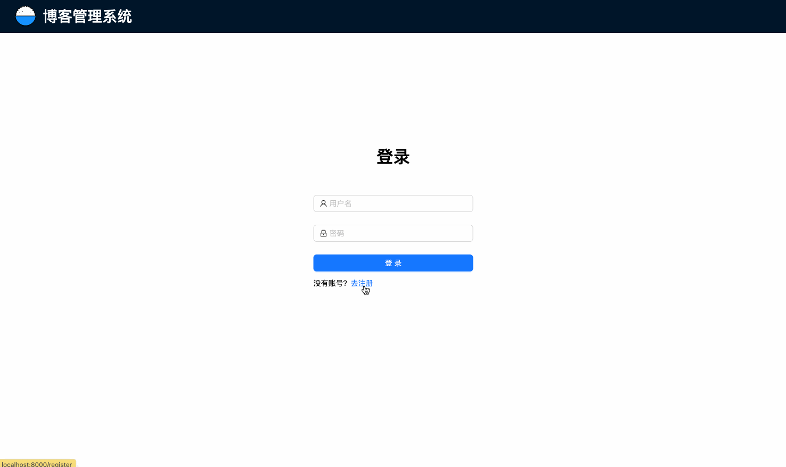

# 博客管理系统

学习 Node 时的一个全栈练手项目，可以实现对用户、文章、评论等维度的数据管理操作。

## 效果展示


## 技术栈
**API**
- 框架：egg（洋葱模型）
- 存储：MongoDB，使用 mongoose 进行模型管理和数据操作
- 鉴权：采用 JWT 进行用户签名

**前端**
- 脚手架：umi
- UI 框架：React
- UI 组件库：antd
- 编程语言：TypeScript、CSS3、HTML5
- 状态管理库：zustand，目前用于用户信息的跨组件通信

## 项目启动

### 环境准备

- **Node 版本**：16

### Api

#### 安装依赖
```bash
cd api
yarn
```

#### 启动服务
```bash
yarn dev
```

### Web

#### 安装依赖
```bash
cd web
yarn
```

#### 启动服务
```bash
yarn dev
```

## 项目总结

本管理系统从用户、文章、评论 3 个维度设计了一个基础的博客管理系统，目前核心流程已经跑通，当然一个真正的博客系统远比这复杂~

在前端上使用了业界比较常用的 umi 脚手架，省去了很多工程化配置相关的工作，让我可以专注于开发具体的逻辑和设计整体架构。目前在用户信息的维护上采用了 zustand 进行状态的集中管理，方便各个模块（Header、发表评论、发表文章等）需要使用的时候不用通过 Props 传来传去

在 API 使用了基于洋葱🧅模型的 egg 框架（类 koa），在设计登录态持久化时耗费了很多时间查资料，但是最后做成功的时候得到的满足感也很多。因为之前没有接触过 Mongo 这种 NoSQL（Not Only SQL） 语言，所以在使用的过程中也比较吃力，不过最终自己从 0 到 1 的把一个数据模型定义、创建、设计接口、查询数据，到最终的展示到前端时，感觉也非常的不错！

该系统作为自己的第一个全栈的项目，在开发过程中虽然遇到了很多问题，但是也受益良多！大家如果有类似诉求的，也可以从这个开始当成迈入全栈开发的第一个项目哦😋

